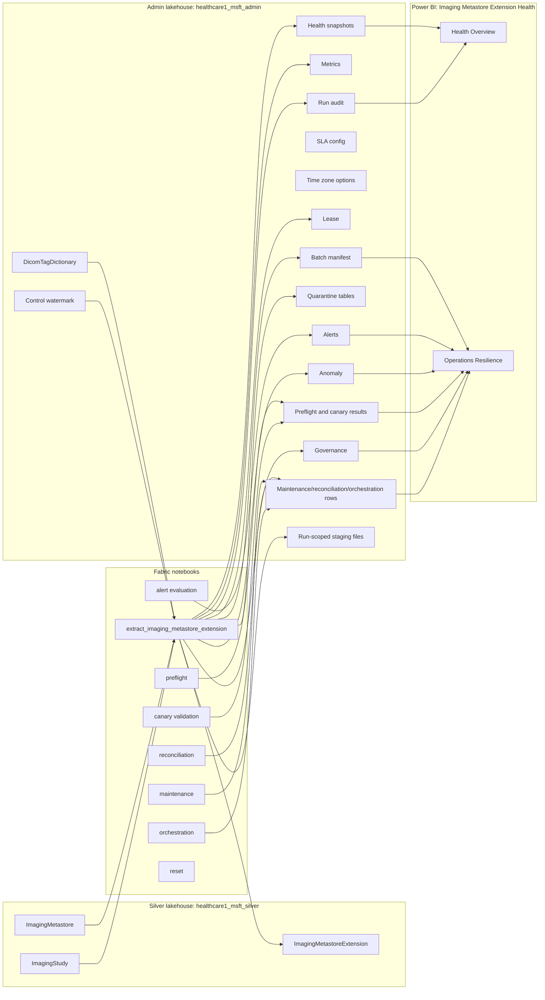

# Imaging Metastore Extension: Implementation Summary and Customer Guide

_Last verified: 2026-07-09_

## Audience and level

This guide is written at a customer-facing L200-L300 depth:

- **L200:** what the solution does, why it exists, where the data lands, and how an operator uses it.
- **L300:** the main tables, parameters, guardrails, failure modes, validation steps, and operational runbooks.

It intentionally avoids low-level Spark implementation line-by-line walkthroughs unless they affect operation, governance, scale, or troubleshooting.

## Executive summary

The Imaging Metastore Extension solution extracts selected DICOM metadata tags from the HDS Silver `ImagingMetastore` table into a governed, query-friendly Delta table named `ImagingMetastoreExtension`.

The extension is designed for large-scale imaging estates. It uses Spark/Delta directly over OneLake paths, not SQL endpoint JSON parsing, because planning found SQL endpoint JSON parsing unreliable for the current `ImagingMetastore.metadata_string` payloads. The pipeline is incremental, auditable, guarded by batch limits and leases, and surfaced through a Power BI health report.

The implementation now includes:

- A deployable Fabric extraction notebook.
- A guarded reset notebook.
- An orchestration notebook.
- Preflight validation.
- Canary validation.
- Deferred patch/delete reconciliation support.
- Alert evaluation.
- Maintenance dry-run/maintenance notebook.
- Power BI report pages for health and operational resilience.
- Admin lakehouse operational tables for audit, control, metrics, leases, manifests, anomalies, governance, validation, alerts, and report backing.

## Tenant and workspace context

| Area | Value |
|---|---|
| Fabric workspace | `FUJIV_Fabric_Test` |
| Workspace ID | `ad5aafc2-395b-442a-9fd0-b1ba87aa067b` |
| Silver lakehouse | `healthcare1_msft_silver` |
| Silver lakehouse ID | `56b4d69b-229e-46a9-8d75-5ca64db20399` |
| Admin lakehouse | `healthcare1_msft_admin` |
| Admin lakehouse ID | `d739287d-e323-45ce-819a-20a37d2a05ca` |
| Fabric notebook folder | `DICOM Tag Extension` |
| Power BI report | `Imaging Metastore Extension Health` |
| Power BI semantic model ID | `c5c4a387-a9ef-4df7-82a9-826f3ba9d922` |
| Power BI report ID | `629da0b5-8046-4ad8-b597-cabbeb38498f` |
| Report URL | `https://app.fabric.microsoft.com/groups/ad5aafc2-395b-442a-9fd0-b1ba87aa067b/reports/629da0b5-8046-4ad8-b597-cabbeb38498f` |

## High-level architecture



## What has been implemented

### Local source files

| File | Purpose |
|---|---|
| `extract_imaging_metastore_extension.py` | Main active incremental extraction notebook source. Creates/seeds required Admin tables, reads Silver source rows, parses configured tags, joins ImagingStudy, validates, merges into Silver target, writes audit/metrics/health. |
| `deploy-imaging-metastore-extension-notebook.ps1` | Deployment wrapper for the extraction notebook. Creates or updates the Fabric notebook, binds the Silver default lakehouse, moves it to the requested folder, and optionally runs it with parameters. |
| `reset_imaging_metastore_extension.py` | Guarded reset notebook. Can clear the Silver target table and/or Admin control watermark after explicit confirmation. |
| `Deploy-ResetImagingMetastoreExtension.ps1` | Deployment wrapper for the reset notebook. |
| `Deploy-DicomTagExtensionNotebook.ps1` | Generic deployment wrapper used for operational notebooks. Supports create/update, folder move, Fabric parameter cell, optional RunNotebook execution, and job polling. |
| `orchestrate_imaging_metastore_extension.py` | Operator-facing orchestration notebook. Can plan only, run dry-run extraction, run incremental extraction, or run guarded full rebuild. |
| `preflight_imaging_metastore_extension.py` | Validates required source/admin table prerequisites and writes preflight result rows. |
| `validate_imaging_metastore_extension_canaries.py` | Validates configured canary studies against the target table and checks that person-name fields are parsed as clean values, not raw JSON objects. |
| `reconcile_imaging_metastore_extension_patch_operations.py` | Deferred patch/delete reconciliation notebook. Currently handles `msftIsDeleted=true` source rows and intentionally excludes broad anti-join deletion. Defaults to dry run. |
| `evaluate_imaging_metastore_extension_alerts.py` | Reads latest health/anomaly data and writes alert rows. Can optionally fail on Red alerts. |
| `maintain_imaging_metastore_extension.py` | Guarded maintenance notebook. Supports dry-run target row count and explicit guarded `OPTIMIZE` / `VACUUM`. |
| `Deploy-ImagingMetastoreExtensionHealthReport.ps1` | Deploys or updates the Power BI semantic model and report from PBIP/TMDL source. |
| `Deploy-DicomTagExtensionMaintenancePipeline.ps1` | Creates or updates the separate DICOM Tag Extension maintenance DataPipeline and moves it into the `DICOM Tag Extension` folder. |
| `Deploy-DicomTagExtensionExtractionPipeline.ps1` | Creates or updates the normal DICOM Tag Extension extraction DataPipeline: preflight, incremental extraction, canary validation, and alert evaluation. |
| `ImagingMetastoreExtensionHealth.SemanticModel/definition/*` | Direct Lake semantic model over Admin lakehouse operational tables. |
| `ImagingMetastoreExtensionHealth.Report/definition/*` | Power BI report definition with Health Overview and Operations Resilience pages. |

### Deployed Fabric notebooks

All notebooks were deployed into Fabric folder `DICOM Tag Extension`.

| Notebook | Fabric item ID |
|---|---|
| `01_preflight_imaging_metastore_extension` | `bc6a365c-eb27-4df6-ad18-56fcd2efbac9` |
| `02_extract_imaging_metastore_extension` | `72170806-ee66-4fa2-987b-1974ed1ff79a` |
| `03_validate_imaging_metastore_extension_canaries` | `f971b518-f9ed-48ee-a4a0-764955098ee5` |
| `04_evaluate_imaging_metastore_extension_alerts` | `86a36be8-1c63-4302-9b2b-1dd868730764` |
| `10_reconcile_imaging_metastore_extension_patch_operations` | `0077478a-92fa-4742-8107-354b4e29d5ac` |
| `20_maintain_imaging_metastore_extension` | `b8a9b2b4-5761-4f4f-acef-6e0b17147cf8` |
| `90_orchestrate_imaging_metastore_extension` | `1a0c6f89-d814-4920-9013-54b3716e4c55` |
| `99_reset_imaging_metastore_extension` | `3dce4706-244c-477f-934d-621ec0b98087` |
| `01_dicom_tag_extension_extraction_pipeline` | `2d89b154-7da4-4c2c-b79f-d51578dbb75d` |
| `20_dicom_tag_extension_maintenance_pipeline` | `1adea5f5-ebf0-4f63-ad71-053abce038fc` |

## Data placement model

### Silver lakehouse

Silver is reserved for curated data products.

| Table | Purpose |
|---|---|
| `ImagingMetastore` | Existing HDS source table. Contains one or more imaging metadata rows with DICOM payloads. |
| `ImagingStudy` | Existing HDS source table used to resolve the matching FHIR `ImagingStudy.id`. |
| `ImagingMetastoreExtension` | New wide extension table. One active row per deduplicated `ImagingMetastore.id`, with source references, joined `ImagingStudy.id`, extracted DICOM tag columns, active flag, source hash, and extraction metadata. |
| `ImagingMetastoreWellKnownTags` | Planned/previously discussed reporting-friendly pivot/well-known surface. The current implemented extraction focuses on the wide `ImagingMetastoreExtension` target and Power BI health/operations reporting. |

### Admin lakehouse

Admin stores operational state, governance, validation, and report backing. This keeps audit/control data separate from the Silver data product.

| Table | Current verified row count | Purpose |
|---|---:|---|
| `DicomTagDictionary` | 29 | Configurable dictionary of DICOM tags to extract. Seeded with 29 HDS well-known tags. User-added rows are preserved. |
| `ImagingMetastoreExtensionControl` | 1 | Incremental watermark state by pipeline, target, source system, and hash bucket. |
| `ImagingMetastoreExtensionRun` | 23 | Extraction run audit rows. Tracks status, batch, watermark, source counts, parse counts, target insert/update counts, duration, and errors. |
| `ImagingMetastoreExtensionMetrics` | 668 | Metric fact rows per extraction run, including source metrics, parse metrics, extension metrics, UID validation metrics, and tag coverage. |
| `ImagingMetastoreExtensionHealth` | 10 | Health snapshots used by the Health Overview Power BI page. |
| `ImagingMetastoreExtensionSlaConfig` | 2 | Configurable SLA thresholds and display time-zone settings. |
| `ImagingMetastoreExtensionTimeZoneOption` | 2 | Report time-zone slicer options. Seeded with UTC and Pacific Standard Time. |
| `ImagingMetastoreExtensionLease` | 2 | Extraction lease rows. Prevents overlapping active extraction runs. |
| `ImagingMetastoreExtensionBatchManifest` | 2 | Batch/run manifest rows. Tracks batch mode, expected/processed rows, status, time window, study filter, and errors. |
| `ImagingMetastoreExtensionParseQuarantine` | 0 | Rows that failed enabled-tag parsing thresholds. |
| `ImagingMetastoreExtensionJoinQuarantine` | 0 | Rows that failed to join to `ImagingStudy`. |
| `ImagingMetastoreExtensionValidationQuarantine` | 0 | Rows with UID validation mismatches between source columns and tag payload values. |
| `ImagingMetastoreExtensionAnomaly` | 0 | Run anomaly rows such as zero staged rows, parse failures, missing studies, or 10x source-row drift. |
| `ImagingMetastoreExtensionGovernance` | 29 | PHI/governance metadata for extracted columns. |
| `ImagingMetastoreExtensionCanaryStudy` | 5 | Configured canary study UIDs used by canary validation. |
| `ImagingMetastoreExtensionPreflight` | 10 | Preflight check results. |
| `ImagingMetastoreExtensionCanaryResult` | 5 | Canary validation results. |
| `ImagingMetastoreExtensionMaintenanceRun` | 1 | Maintenance notebook run history. |
| `ImagingMetastoreExtensionReconciliationRun` | 1 | Reconciliation notebook run history. |
| `ImagingMetastoreExtensionAlert` | 1 | Alert evaluation output. |
| `ImagingMetastoreExtensionOrchestrationRun` | Pending SQL endpoint visibility | The orchestration notebook writes this table, and the report model includes it. At the last SQL endpoint check, the table was not yet visible through SQL endpoint metadata even after a metadata refresh. The orchestration notebook itself completed successfully. |

## DICOM tags extracted today

The seed dictionary enables 29 HDS well-known DICOM tags. The table can be extended later by adding rows to `DicomTagDictionary` and keeping the enabled count below the guardrail.

| DICOM tag | Keyword | Target column | VR | Scope | PHI | PHI category |
|---|---|---|---|---|---:|---|
| `0020000D` | `StudyInstanceUID` | `studyInstanceUid_tag` | UI | study | No | None |
| `00100010` | `PatientName` | `patientName` | PN | patient | Yes | DirectIdentifier |
| `00100040` | `PatientSex` | `patientSex` | CS | patient | Yes | QuasiIdentifier |
| `00100020` | `PatientID` | `patientId` | LO | patient | Yes | DirectIdentifier |
| `00100030` | `PatientBirthDate` | `patientBirthDate` | DA | patient | Yes | QuasiIdentifier |
| `00080050` | `AccessionNumber` | `accessionNumber` | SH | study | Yes | DirectIdentifier |
| `00080090` | `ReferringPhysicianName` | `referringPhysicianName` | PN | study | Yes | DirectIdentifier |
| `00080020` | `StudyDate` | `studyDate` | DA | study | No | None |
| `00081030` | `StudyDescription` | `studyDescription` | LO | study | No | None |
| `0020000E` | `SeriesInstanceUID` | `seriesInstanceUid_tag` | UI | series | No | None |
| `00080060` | `Modality` | `modality` | CS | series | No | None |
| `00080061` | `ModalitiesInStudy` | `modalitiesInStudy` | CS | study | No | None |
| `00400244` | `PerformedProcedureStepStartDate` | `performedProcedureStepStartDate` | DA | procedure | No | None |
| `00081090` | `ManufacturerModelName` | `manufacturerModelName` | LO | series | No | None |
| `00080018` | `SOPInstanceUID` | `sopInstanceUid_tag` | UI | instance | No | None |
| `00080030` | `StudyTime` | `studyTime` | TM | study | No | None |
| `00080201` | `TimezoneOffsetFromUTC` | `timezoneOffsetFromUtc` | SH | study | No | None |
| `00201206` | `NumberOfStudyRelatedSeries` | `numberOfStudyRelatedSeries` | IS | study | No | None |
| `00201208` | `NumberOfStudyRelatedInstances` | `numberOfStudyRelatedInstances` | IS | study | No | None |
| `00200011` | `SeriesNumber` | `seriesNumber` | IS | series | No | None |
| `0008103E` | `SeriesDescription` | `seriesDescription` | LO | series | No | None |
| `00201209` | `NumberOfSeriesRelatedInstances` | `numberOfSeriesRelatedInstances` | IS | series | No | None |
| `00180015` | `BodyPartExamined` | `bodyPartExamined` | CS | series | No | None |
| `00200060` | `Laterality` | `laterality` | CS | series | No | None |
| `00080021` | `SeriesDate` | `seriesDate` | DA | series | No | None |
| `00080031` | `SeriesTime` | `seriesTime` | TM | series | No | None |
| `00080016` | `SOPClassUID` | `sopClassUid` | UI | instance | No | None |
| `00200013` | `InstanceNumber` | `instanceNumber` | IS | instance | No | None |
| `00420010` | `DocumentTitle` | `documentTitle` | ST | instance | No | None |

### Why three UID tags have `_tag` suffixes

`ImagingMetastore` already has source columns named `studyInstanceUid`, `seriesInstanceUid`, and `sopInstanceUid`. The extracted DICOM tag values for those same concepts are stored as:

- `studyInstanceUid_tag`
- `seriesInstanceUid_tag`
- `sopInstanceUid_tag`

The notebook validates that source UID columns and parsed tag UID values match when both are present. Mismatches are quarantined and fail the run.

## Extraction process walkthrough

### 1. Resolve Fabric context

The notebook resolves the current Fabric workspace and lakehouse IDs at runtime. This avoids hardcoding lakehouse IDs inside business logic and allows deployment wrappers to target the workspace/lakehouse names.

### 2. Create or update Admin operational tables

At startup, the extraction notebook ensures required Admin Delta tables exist and adds missing schema columns when a table already exists. This allows safe forward schema evolution for operational metadata.

### 3. Seed config tables

The notebook seeds:

- `DicomTagDictionary` with the 29 well-known tags if they are missing.
- `ImagingMetastoreExtensionSlaConfig` with default SLA thresholds.
- `ImagingMetastoreExtensionTimeZoneOption` with UTC and Pacific Standard Time.
- `ImagingMetastoreExtensionGovernance` with PHI classification and recommended sensitivity labels.

Existing customer-added dictionary rows are not overwritten.

### 4. Acquire lease

Before reading source data, the notebook acquires an active lease in `ImagingMetastoreExtensionLease`. If another active unexpired lease exists, the run fails instead of overlapping another extraction.

### 5. Determine batch mode

The extraction supports four practical modes:

| Mode | Trigger | Watermark behavior |
|---|---|---|
| Initial load | No control watermark and no explicit filter/window | Reads all active `ImagingMetastore` rows. On success, writes watermark. |
| Incremental | Control watermark exists and no explicit window/filter | Reads rows with `sourceModifiedAt >= lastSuccessfulHighWatermark - WATERMARK_OVERLAP_HOURS`. On success, advances watermark. |
| Explicit source window | Both `BATCH_START_SOURCE_MODIFIED_AT` and `BATCH_END_SOURCE_MODIFIED_AT` supplied | Reads only the half-open source window. On success, advances watermark unless constrained by test-specific filters. |
| Study filter | `FILTER_STUDY_INSTANCE_UIDS` supplied | Reads only selected study UIDs. Does not advance control watermark. |
| Study sample | `SAMPLE_STUDY_COUNT` supplied and no explicit UID list supplied | Deterministically selects the most recently modified N study UIDs. Does not advance control watermark. |

### Source-key compatibility

Some Silver source populations can contain multiple SOP rows sharing one `ImagingMetastore.id`. The extension target therefore uses `sourceRecordKey`, a SHA-256 key composed from `msftSourceSystem`, `studyInstanceUid`, `seriesInstanceUid`, `sopInstanceUid`, and `filePath`. This preserves SOP-level rows even when the upstream source ID repeats. The source ID remains retained for lineage, while `sourceRecordKey` is the extension merge identity.

### 6. Filter active source rows

Source rows are read from Silver `ImagingMetastore` and filtered where `msftIsDeleted` is false or null. Delete/patch reconciliation is intentionally handled by a separate notebook.

### 7. Add scale partitions and batch guardrails

Each source row receives:

- `sourceModifiedDate`, derived from `sourceModifiedAt` and used for target partitioning.
- `sourceSystemHashBucket`, derived from `msftSourceSystem`, used as a second partition field.

The notebook counts candidate rows before expensive parsing. If the count exceeds `MAX_SOURCE_ROWS_PER_BATCH`, the run fails and instructs the operator to narrow the batch.

### 8. Deduplicate source rows

Active `ImagingMetastore` source rows are deterministically deduplicated by `id`. The winning row is selected by:

1. latest `sourceModifiedAt`,
2. largest metadata payload,
3. stable UID/path/source-system ordering.

Deduplication metrics are written to Admin metrics and health snapshots.

### 9. Stage source rows

Filtered and deduplicated source rows are written to a run-scoped Admin staging path:

```text
Files/_staging/extract_imaging_metastore_extension/{extractRunId}/source
```

This prevents repeated source scans during the run and gives operators a retained staging location when failures occur.

### 10. Join to ImagingStudy

The notebook builds an `ImagingStudy` reference from `identifier_string`, looking for identifiers with `system = urn:dicom:uid`. It strips a leading `urn:oid:` when needed and joins by `msftSourceSystem` and `studyInstanceUid`.

If active `ImagingMetastore` rows cannot join to `ImagingStudy`, the rows are written to `ImagingMetastoreExtensionJoinQuarantine` and the extraction fails. This is deliberate: the target must reference both source `ImagingMetastore.id` and matching `ImagingStudy.id`.

### 11. Parse DICOM metadata

The notebook extracts enabled dictionary tags from structured metadata JSON. It supports DICOM person-name values where `Value[0]` is an object such as:

```json
{"Alphabetic":"DOE^JANE"}
```

For those values, the notebook extracts the `Alphabetic` property and preserves caret separators.

### 12. Build wide target rows

The target row contains:

- `id`
- `imagingMetastoreId`
- `imagingStudyId`
- source UIDs and source path fields
- extracted DICOM columns
- `isActive`
- `sourceRowHash`
- `extractedAt`
- `extractRunId`

The target is partitioned by:

- `sourceModifiedDate`
- `sourceSystemHashBucket`

### 13. Validate UID consistency

The notebook checks source UID columns against parsed UID tag values:

- `studyInstanceUid` vs `studyInstanceUid_tag`
- `seriesInstanceUid` vs `seriesInstanceUid_tag`
- `sopInstanceUid` vs `sopInstanceUid_tag`

Mismatches are written to `ImagingMetastoreExtensionValidationQuarantine` and fail the run.

### 14. Merge into Silver target

The notebook merges staged rows into Silver `ImagingMetastoreExtension` using `imagingMetastoreId` as the key.

- New keys are inserted.
- Existing keys are updated only when `sourceRowHash` changed.
- Unchanged rows are left untouched.

### 15. Write metrics and health

On success, the notebook writes:

- source-row metrics,
- deduplication metrics,
- join metrics,
- parse metrics,
- target insert/update metrics,
- per-tag non-null coverage metrics,
- UID validation metrics,
- anomaly rows when guardrail conditions are triggered,
- run audit row,
- health snapshot row,
- batch manifest row.

If target merge succeeds but metrics write fails, the run is marked `FailedMetricsWrite`, the control watermark is not advanced, and target data remains intact for idempotent rerun.

### 16. Advance control watermark

The control watermark advances only after successful extraction and metrics/audit behavior. Study-filter test runs do not advance the watermark.

### 17. Release lease and clean staging

On normal success, staging is deleted and the lease is released. If staging cleanup fails, the run is marked `SucceededWithCleanupWarning`, a health snapshot is written, and the staging path is retained in the error message.

## Key parameters

### Main extraction notebook

| Parameter | Default | Description |
|---|---:|---|
| `BATCH_START_SOURCE_MODIFIED_AT` | empty | Start timestamp for explicit source window. Must be paired with end timestamp. |
| `BATCH_END_SOURCE_MODIFIED_AT` | empty | End timestamp for explicit source window. Half-open interval: `>= start` and `< end`. |
| `MAX_SOURCE_ROWS_PER_BATCH` | `50000000` | Batch guardrail. Fails before parsing if candidate source rows exceed this value. |
| `WATERMARK_OVERLAP_HOURS` | `24` | Overlap applied to incremental watermark to tolerate late-arriving source updates. |
| `HASH_BUCKET_COUNT` | `128` | Number of hash buckets for source-system partition helper. |
| `MAX_ENABLED_TAGS` | `500` | Safety limit for enabled dictionary tags. Prevents uncontrolled schema/storage expansion. |
| `FILTER_STUDY_INSTANCE_UIDS` | empty | Comma-separated study UID list for bounded tests. Does not advance watermark. |
| `SAMPLE_STUDY_COUNT` | empty | Optional deterministic N-study sample for bounded tests. Ignored when `FILTER_STUDY_INSTANCE_UIDS` is supplied. Does not advance watermark. |
| `DRY_RUN_ONLY` | `false` | Counts candidate rows and writes run/manifest status without parsing/merging target rows. |
| `FILTER_SOURCE_SYSTEM` | empty | Limits extraction to one `msftSourceSystem`. |
| `FILTER_SOURCE_SYSTEM_HASH_BUCKET` | empty | Limits extraction to one hash bucket. |
| `LEASE_TIMEOUT_MINUTES` | `240` | Active lease duration. Overlapping extraction runs fail while a live lease exists. |
| `MANIFEST_BATCH_ID` | empty | Optional external manifest batch ID. Defaults to `{extractRunId}-001`. |
| `ORCHESTRATION_RUN_ID` | empty | Optional parent orchestration run ID. |
| `CLEAR_TARGET_BEFORE_RUN` | empty | Guarded destructive switch. Only `DELETE_ALL_EXTENSION_ROWS` is accepted. Leave empty for normal operation. |

### Orchestration notebook

| Parameter | Default | Description |
|---|---:|---|
| `RUN_MODE` | `dryRun` | `dryRun`, `incremental`, or `fullRebuild`. |
| `EXECUTE` | `false` | When false, writes a plan row only. When true, runs child notebooks. |
| `CONFIRM_FULL_REBUILD` | empty | Required value for full rebuild: `FULL_REBUILD_IMAGING_METASTORE_EXTENSION`. |
| `MAX_SOURCE_ROWS_PER_BATCH` | `50000000` | Passed into child extraction. |

### Reset notebook

| Parameter | Default | Description |
|---|---:|---|
| `CONFIRM_RESET` | empty | Required value: `RESET_IMAGING_METASTORE_EXTENSION`. |
| `RESET_TARGET_TABLE` | `true` | Deletes rows from Silver `ImagingMetastoreExtension`. |
| `RESET_CONTROL_WATERMARK` | `true` | Deletes the Admin control row so next unfiltered extraction behaves like initial load. |

### Preflight notebook

| Parameter | Default | Description |
|---|---:|---|
| `FAIL_ON_ERROR` | `false` | When true, failed checks fail the notebook. When false, failed checks are written for review. |

### Canary notebook

| Parameter | Default | Description |
|---|---:|---|
| `FAIL_ON_ERROR` | `false` | When true, failed canaries fail the notebook. |
| `SEED_FROM_TARGET_IF_EMPTY` | `true` | Seeds canary studies from current target when no canaries exist. |
| `MAX_CANARY_STUDIES` | `5` | Max studies to seed from target. |

### Reconciliation notebook

| Parameter | Default | Description |
|---|---:|---|
| `DRY_RUN_ONLY` | `true` | Defaults to dry run. |
| `CONFIRM_RECONCILE` | empty | Required for non-dry run: `RECONCILE_IMAGING_METASTORE_EXTENSION`. |
| `FILTER_STUDY_INSTANCE_UIDS` | empty | Optional bounded study filter. |
| `BATCH_START_SOURCE_MODIFIED_AT` | empty | Optional source window start. |
| `BATCH_END_SOURCE_MODIFIED_AT` | empty | Optional source window end. |

### Maintenance notebook

| Parameter | Default | Description |
|---|---:|---|
| `DRY_RUN_ONLY` | `true` | Defaults to dry run. |
| `CONFIRM_MAINTENANCE` | empty | Required for non-dry maintenance: `MAINTAIN_IMAGING_METASTORE_EXTENSION`. |
| `RUN_OPTIMIZE` | `false` | Runs Delta `OPTIMIZE` only with explicit confirmation and non-dry mode. |
| `RUN_VACUUM` | `false` | Runs Delta `VACUUM` only with explicit confirmation and non-dry mode. |
| `VACUUM_RETAIN_HOURS` | `168` | Vacuum retention hours. |

### Alert notebook

| Parameter | Default | Description |
|---|---:|---|
| `FAIL_ON_RED` | `false` | When true, Red alerts fail the notebook. |

## Operational runbooks

### Deploy or update the main extraction notebook

```powershell
cd FabricDicomCohortingToolkit

./deploy-imaging-metastore-extension-notebook.ps1 `
  -FabricWorkspaceName "FUJIV_Fabric_Test" `
  -SilverLakehouseName "healthcare1_msft_silver" `
  -AdminLakehouseName "healthcare1_msft_admin" `
  -NotebookFolderName "DICOM Tag Extension"
```

### Deploy or update the extraction pipeline

```powershell
cd FabricDicomCohortingToolkit

./Deploy-DicomTagExtensionExtractionPipeline.ps1 `
  -FabricWorkspaceName "FUJIV_Fabric_Test" `
  -PipelineName "01_dicom_tag_extension_extraction_pipeline" `
  -NotebookFolderName "DICOM Tag Extension" `
  -DefaultFilterStudyInstanceUids "" `
  -DefaultSampleStudyCount "" `
  -DefaultDryRunOnly "false"
```

This is the normal production path for active extraction:

```text
01_Preflight -> 02_Extract_Incremental -> 03_Canary_Validation -> 04_Evaluate_Alerts
```

Default pipeline gates are intentionally strict: preflight uses `FAIL_ON_ERROR=true`, canaries use `FAIL_ON_ERROR=true`, and alert evaluation uses `FAIL_ON_RED=true`. Maintenance and reconciliation remain separate from this pipeline.

To run a targeted pipeline execution, use Fabric pipeline parameters rather than editing the notebook:

| Pipeline parameter | Default | Effect |
|---|---:|---|
| `FilterStudyInstanceUids` | empty | Comma-separated exact study UIDs. Wins over `SampleStudyCount`. |
| `SampleStudyCount` | empty | Deterministically selects N recently modified studies for a bounded run. |
| `DryRunOnly` | `false` | Runs extraction in dry-run mode when `true`. |
| `MaxSourceRowsPerBatch` | `50000000` | Batch row guardrail. |
| `WatermarkOverlapHours` | `24` | Incremental overlap. |
| `HashBucketCount` | `128` | Hash bucket count parameter. |
| `MaxEnabledTags` | `500` | Enabled-tag guardrail. |
| `LeaseTimeoutMinutes` | `240` | Extraction lease timeout. |

Examples: set `FilterStudyInstanceUids="uid1,uid2,uid3,uid4,uid5"` to tag five known studies, or set `SampleStudyCount="5"` to tag a deterministic five-study sample. Both targeted modes skip control-watermark advancement.

### Deploy or update an operational notebook

```powershell
cd FabricDicomCohortingToolkit

./Deploy-DicomTagExtensionNotebook.ps1 `
  -FabricWorkspaceName "FUJIV_Fabric_Test" `
  -SilverLakehouseName "healthcare1_msft_silver" `
  -AdminLakehouseName "healthcare1_msft_admin" `
  -NotebookName 01_preflight_imaging_metastore_extension `
  -SourceFile preflight_imaging_metastore_extension.py
```

Change `-NotebookName` and `-SourceFile` for canary, reconciliation, alerts, maintenance, or orchestration.

### Run preflight validation

```powershell
./Deploy-DicomTagExtensionNotebook.ps1 `
  -FabricWorkspaceName "FUJIV_Fabric_Test" `
  -SilverLakehouseName "healthcare1_msft_silver" `
  -AdminLakehouseName "healthcare1_msft_admin" `
  -NotebookName 01_preflight_imaging_metastore_extension `
  -SourceFile preflight_imaging_metastore_extension.py `
  -RunAfterDeploy `
  -NotebookParameters @{ FAIL_ON_ERROR = "false" }
```

Use `FAIL_ON_ERROR = "true"` in a pipeline gate when failed preflight checks should stop downstream execution.

### Run a bounded extraction dry run

```powershell
./deploy-imaging-metastore-extension-notebook.ps1 `
  -FabricWorkspaceName "FUJIV_Fabric_Test" `
  -SilverLakehouseName "healthcare1_msft_silver" `
  -AdminLakehouseName "healthcare1_msft_admin" `
  -NotebookFolderName "DICOM Tag Extension" `
  -RunAfterDeploy `
  -NotebookParameters @{ `
    DRY_RUN_ONLY = "true"; `
    FILTER_STUDY_INSTANCE_UIDS = "1.2.3.4.5"; `
    MAX_SOURCE_ROWS_PER_BATCH = "1000"; `
    LEASE_TIMEOUT_MINUTES = "30" `
  }
```

Dry run writes run/manifest audit rows and validates candidate source counts without merging target rows.

### Run a bounded study extraction test

```powershell
./deploy-imaging-metastore-extension-notebook.ps1 `
  -FabricWorkspaceName "FUJIV_Fabric_Test" `
  -SilverLakehouseName "healthcare1_msft_silver" `
  -AdminLakehouseName "healthcare1_msft_admin" `
  -NotebookFolderName "DICOM Tag Extension" `
  -RunAfterDeploy `
  -NotebookParameters @{ `
    FILTER_STUDY_INSTANCE_UIDS = "1.2.3.4.5"; `
    MAX_SOURCE_ROWS_PER_BATCH = "1000"; `
    LEASE_TIMEOUT_MINUTES = "30" `
  }
```

A study-filtered test does not advance the control watermark.

### Run normal incremental extraction

```powershell
./deploy-imaging-metastore-extension-notebook.ps1 `
  -FabricWorkspaceName "FUJIV_Fabric_Test" `
  -SilverLakehouseName "healthcare1_msft_silver" `
  -AdminLakehouseName "healthcare1_msft_admin" `
  -NotebookFolderName "DICOM Tag Extension" `
  -RunAfterDeploy `
  -NotebookParameters @{ `
    MAX_SOURCE_ROWS_PER_BATCH = "50000000"; `
    WATERMARK_OVERLAP_HOURS = "24" `
  }
```

Normal incremental extraction uses the Admin control watermark when present.

### Run an explicit source-modified window

```powershell
./deploy-imaging-metastore-extension-notebook.ps1 `
  -FabricWorkspaceName "FUJIV_Fabric_Test" `
  -SilverLakehouseName "healthcare1_msft_silver" `
  -AdminLakehouseName "healthcare1_msft_admin" `
  -NotebookFolderName "DICOM Tag Extension" `
  -RunAfterDeploy `
  -NotebookParameters @{ `
    BATCH_START_SOURCE_MODIFIED_AT = "2026-07-09T00:00:00Z"; `
    BATCH_END_SOURCE_MODIFIED_AT = "2026-07-09T01:00:00Z"; `
    MAX_SOURCE_ROWS_PER_BATCH = "1000000" `
  }
```

### Plan orchestration without running child notebooks

```powershell
./Deploy-DicomTagExtensionNotebook.ps1 `
  -FabricWorkspaceName "FUJIV_Fabric_Test" `
  -SilverLakehouseName "healthcare1_msft_silver" `
  -AdminLakehouseName "healthcare1_msft_admin" `
  -NotebookName 90_orchestrate_imaging_metastore_extension `
  -SourceFile orchestrate_imaging_metastore_extension.py `
  -RunAfterDeploy `
  -NotebookParameters @{ RUN_MODE = "dryRun"; EXECUTE = "false" }
```

### Run orchestration dry run

```powershell
./Deploy-DicomTagExtensionNotebook.ps1 `
  -FabricWorkspaceName "FUJIV_Fabric_Test" `
  -SilverLakehouseName "healthcare1_msft_silver" `
  -AdminLakehouseName "healthcare1_msft_admin" `
  -NotebookName 90_orchestrate_imaging_metastore_extension `
  -SourceFile orchestrate_imaging_metastore_extension.py `
  -RunAfterDeploy `
  -NotebookParameters @{ RUN_MODE = "dryRun"; EXECUTE = "true" }
```

### Run orchestration incremental mode

```powershell
./Deploy-DicomTagExtensionNotebook.ps1 `
  -FabricWorkspaceName "FUJIV_Fabric_Test" `
  -SilverLakehouseName "healthcare1_msft_silver" `
  -AdminLakehouseName "healthcare1_msft_admin" `
  -NotebookName 90_orchestrate_imaging_metastore_extension `
  -SourceFile orchestrate_imaging_metastore_extension.py `
  -RunAfterDeploy `
  -NotebookParameters @{ RUN_MODE = "incremental"; EXECUTE = "true"; MAX_SOURCE_ROWS_PER_BATCH = "50000000" }
```

### Run guarded full rebuild

Use only after an explicit operational decision.

```powershell
./Deploy-DicomTagExtensionNotebook.ps1 `
  -FabricWorkspaceName "FUJIV_Fabric_Test" `
  -SilverLakehouseName "healthcare1_msft_silver" `
  -AdminLakehouseName "healthcare1_msft_admin" `
  -NotebookName 90_orchestrate_imaging_metastore_extension `
  -SourceFile orchestrate_imaging_metastore_extension.py `
  -RunAfterDeploy `
  -NotebookParameters @{ `
    RUN_MODE = "fullRebuild"; `
    EXECUTE = "true"; `
    CONFIRM_FULL_REBUILD = "FULL_REBUILD_IMAGING_METASTORE_EXTENSION"; `
    MAX_SOURCE_ROWS_PER_BATCH = "50000000" `
  }
```

Full rebuild runs the reset notebook and then extraction. The reset requires its own confirmation string internally.

### Run reset directly

Use only when intentionally clearing target and/or watermark state.

```powershell
./Deploy-ResetImagingMetastoreExtension.ps1 `
  -FabricWorkspaceName "FUJIV_Fabric_Test" `
  -SilverLakehouseName "healthcare1_msft_silver" `
  -AdminLakehouseName "healthcare1_msft_admin" `
  -RunAfterDeploy `
  -NotebookParameters @{ `
    CONFIRM_RESET = "RESET_IMAGING_METASTORE_EXTENSION"; `
    RESET_TARGET_TABLE = "true"; `
    RESET_CONTROL_WATERMARK = "true" `
  }
```

### Run canary validation

```powershell
./Deploy-DicomTagExtensionNotebook.ps1 `
  -FabricWorkspaceName "FUJIV_Fabric_Test" `
  -SilverLakehouseName "healthcare1_msft_silver" `
  -AdminLakehouseName "healthcare1_msft_admin" `
  -NotebookName 03_validate_imaging_metastore_extension_canaries `
  -SourceFile validate_imaging_metastore_extension_canaries.py `
  -RunAfterDeploy `
  -NotebookParameters @{ FAIL_ON_ERROR = "false"; SEED_FROM_TARGET_IF_EMPTY = "true"; MAX_CANARY_STUDIES = "5" }
```

### Run reconciliation dry run

```powershell
./Deploy-DicomTagExtensionNotebook.ps1 `
  -FabricWorkspaceName "FUJIV_Fabric_Test" `
  -SilverLakehouseName "healthcare1_msft_silver" `
  -AdminLakehouseName "healthcare1_msft_admin" `
  -NotebookName 10_reconcile_imaging_metastore_extension_patch_operations `
  -SourceFile reconcile_imaging_metastore_extension_patch_operations.py `
  -RunAfterDeploy `
  -NotebookParameters @{ DRY_RUN_ONLY = "true" }
```

### Run reconciliation apply mode

```powershell
./Deploy-DicomTagExtensionNotebook.ps1 `
  -FabricWorkspaceName "FUJIV_Fabric_Test" `
  -SilverLakehouseName "healthcare1_msft_silver" `
  -AdminLakehouseName "healthcare1_msft_admin" `
  -NotebookName 10_reconcile_imaging_metastore_extension_patch_operations `
  -SourceFile reconcile_imaging_metastore_extension_patch_operations.py `
  -RunAfterDeploy `
  -NotebookParameters @{ DRY_RUN_ONLY = "false"; CONFIRM_RECONCILE = "RECONCILE_IMAGING_METASTORE_EXTENSION" }
```

Current reconciliation scope is intentionally narrow: it soft-deletes target rows whose source `ImagingMetastore.msftIsDeleted` is true. It does not perform broad anti-join deletion.

### Run maintenance dry run

```powershell
./Deploy-DicomTagExtensionNotebook.ps1 `
  -FabricWorkspaceName "FUJIV_Fabric_Test" `
  -SilverLakehouseName "healthcare1_msft_silver" `
  -AdminLakehouseName "healthcare1_msft_admin" `
  -NotebookName 20_maintain_imaging_metastore_extension `
  -SourceFile maintain_imaging_metastore_extension.py `
  -RunAfterDeploy `
  -NotebookParameters @{ DRY_RUN_ONLY = "true"; RUN_OPTIMIZE = "false"; RUN_VACUUM = "false" }
```

### Run maintenance apply mode

```powershell
./Deploy-DicomTagExtensionNotebook.ps1 `
  -FabricWorkspaceName "FUJIV_Fabric_Test" `
  -SilverLakehouseName "healthcare1_msft_silver" `
  -AdminLakehouseName "healthcare1_msft_admin" `
  -NotebookName 20_maintain_imaging_metastore_extension `
  -SourceFile maintain_imaging_metastore_extension.py `
  -RunAfterDeploy `
  -NotebookParameters @{ `
    DRY_RUN_ONLY = "false"; `
    CONFIRM_MAINTENANCE = "MAINTAIN_IMAGING_METASTORE_EXTENSION"; `
    RUN_OPTIMIZE = "true"; `
    RUN_VACUUM = "false" `
  }
```

At this estate scale, do not make `OPTIMIZE` or `VACUUM` part of routine extraction runs. Run maintenance deliberately and separately.

### Deploy or update the separate maintenance pipeline

```powershell
cd FabricDicomCohortingToolkit

./Deploy-DicomTagExtensionMaintenancePipeline.ps1 `
  -FabricWorkspaceName "FUJIV_Fabric_Test" `
  -PipelineName "20_dicom_tag_extension_maintenance_pipeline" `
  -NotebookFolderName "DICOM Tag Extension" `
  -MaintenanceNotebookName "20_maintain_imaging_metastore_extension"
```

The maintenance pipeline is separate from extraction on purpose. Its safe default runs the maintenance notebook in dry-run mode with `RUN_OPTIMIZE=false` and `RUN_VACUUM=false`; edit the activity parameters and supply `CONFIRM_MAINTENANCE` only for an approved maintenance window.

### Run alert evaluation

```powershell
./Deploy-DicomTagExtensionNotebook.ps1 `
  -FabricWorkspaceName "FUJIV_Fabric_Test" `
  -SilverLakehouseName "healthcare1_msft_silver" `
  -AdminLakehouseName "healthcare1_msft_admin" `
  -NotebookName 04_evaluate_imaging_metastore_extension_alerts `
  -SourceFile evaluate_imaging_metastore_extension_alerts.py `
  -RunAfterDeploy `
  -NotebookParameters @{ FAIL_ON_RED = "false" }
```

### Deploy the health report

```powershell
cd FabricDicomCohortingToolkit

./Deploy-ImagingMetastoreExtensionHealthReport.ps1 `
  -FabricWorkspaceName "FUJIV_Fabric_Test" `
  -AdminLakehouseName "healthcare1_msft_admin"
```

The report deployer updates both the semantic model and report definition. It points the semantic model `AdminSource` expression at the Admin lakehouse SQL endpoint.

## Power BI report guide

### Page: Health Overview

The Health Overview page focuses on extraction health.

Primary questions answered:

- Did the latest extraction succeed?
- Is the latest successful run stale?
- How many rows are in the extension table?
- How many Study / Series / SOP UIDs are represented?
- Did the latest run have parse failures or missing ImagingStudy joins?
- What does the run history look like over time?
- What time zone should operational users see?

Key report features:

- Health status card: Green / Amber / Red based on Admin SLA config and last extraction state.
- Latest snapshot timestamp shown in selected/display time zone.
- Time-zone slicer backed by `ImagingMetastoreExtensionTimeZoneOption`.
- Run history table backed by `ImagingMetastoreExtensionHealth`.

### Page: Operations Resilience

The Operations Resilience page focuses on operational control-plane signals.

Cards:

| Card | Backing measure |
|---|---|
| Active Leases | `[Active Leases]` |
| Latest Batch Status | `[Latest Batch Status]` |
| Latest Batch Source Rows | `[Latest Batch Source Rows]` |
| Red Alerts | `[Red Alerts]` |
| Amber Alerts | `[Amber Alerts]` |
| Anomaly Count | `[Anomaly Count]` |
| Preflight Failures | `[Preflight Failures]` |
| Canary Failures | `[Canary Failures]` |
| PHI Columns | `[PHI Columns]` |
| Latest Maintenance Status | `[Latest Maintenance Status]` |
| Latest Reconciliation Status | `[Latest Reconciliation Status]` |
| Latest Orchestration Status | `[Latest Orchestration Status]` |

Tables:

| Visual | Purpose |
|---|---|
| Batch manifest | Shows latest batches, mode, row counts, status, and errors. |
| Alerts | Shows alert severity, alert name, and message. |
| Anomalies | Shows anomaly metric, value, baseline, severity, and message. |
| Preflight | Shows latest source/admin prerequisite checks. |
| Canary | Shows study-level validation results and person-name parse checks. |

### Semantic model tables

| Semantic table | Admin entity |
|---|---|
| `Health` | `ImagingMetastoreExtensionHealth` |
| `TimeZoneOption` | `ImagingMetastoreExtensionTimeZoneOption` |
| `Lease` | `ImagingMetastoreExtensionLease` |
| `BatchManifest` | `ImagingMetastoreExtensionBatchManifest` |
| `Anomaly` | `ImagingMetastoreExtensionAnomaly` |
| `Alert` | `ImagingMetastoreExtensionAlert` |
| `Preflight` | `ImagingMetastoreExtensionPreflight` |
| `CanaryResult` | `ImagingMetastoreExtensionCanaryResult` |
| `MaintenanceRun` | `ImagingMetastoreExtensionMaintenanceRun` |
| `ReconciliationRun` | `ImagingMetastoreExtensionReconciliationRun` |
| `Governance` | `ImagingMetastoreExtensionGovernance` |
| `OrchestrationRun` | `ImagingMetastoreExtensionOrchestrationRun` |
| `_Measures` | Measures table over Admin entities |

## Health and alert logic

### Health status

Health is calculated in the extraction notebook when it writes `ImagingMetastoreExtensionHealth`.

| Status | Meaning |
|---|---|
| Green | Last extraction succeeded within configured SLA and no configured failure threshold was exceeded. |
| Amber | Last extraction succeeded but warning conditions exist, such as cleanup warning, staleness warning, or configured deduplication-rate warning. |
| Red | Last extraction did not succeed, stale-error threshold was exceeded, parse failures exceeded threshold, missing ImagingStudy rows exceeded threshold, or UID mismatch threshold was exceeded. |

### Default SLA config

Seeded defaults:

| Setting | Default |
|---|---:|
| `staleWarningHours` | 26 |
| `staleErrorHours` | 48 |
| `maxParseFailureRows` | 0 |
| `maxMissingImagingStudyRows` | 0 |
| `maxUidMismatchRows` | 0 |
| `maxDeduplicationRate` | null |
| `displayTimeZoneLabel` | `Pacific Standard Time` |
| `displayUtcOffsetHours` | -8.0 |

### Alert generation

The alert notebook reads:

- latest health snapshot,
- recent anomaly rows.

It writes `ImagingMetastoreExtensionAlert` rows for Red/Amber health or anomaly conditions. If `FAIL_ON_RED=true`, Red alerts fail the notebook so it can be used as a pipeline gate.

## Governance and PHI handling

The solution intentionally stores PHI-bearing tags because the requested 29-tag extraction includes them. PHI is visible and governable through metadata, not hidden in code.

PHI-bearing seed tags:

| Column | Tag | PHI category |
|---|---|---|
| `patientName` | `00100010` | DirectIdentifier |
| `patientSex` | `00100040` | QuasiIdentifier |
| `patientId` | `00100020` | DirectIdentifier |
| `patientBirthDate` | `00100030` | QuasiIdentifier |
| `accessionNumber` | `00080050` | DirectIdentifier |
| `referringPhysicianName` | `00080090` | DirectIdentifier |

The governance table marks PHI columns with recommended sensitivity label `Confidential - PHI`. Non-PHI columns are marked `General`.

## Scale design notes

The design choices below support the stated 9PB direction:

- Spark/Delta over OneLake paths instead of SQL endpoint JSON parsing.
- Incremental source filtering by `sourceModifiedAt` after initial load.
- Watermark overlap to handle late-arriving source updates.
- `MAX_SOURCE_ROWS_PER_BATCH` guardrail to prevent accidental estate-wide scans.
- Optional explicit source windows for controlled backfills.
- Optional source system and hash bucket filters for partitioned processing.
- Run-scoped staging in Admin Files so the run does not repeatedly scan source rows.
- Partitioned target table by `sourceModifiedDate` and `sourceSystemHashBucket`.
- Separate reconciliation and maintenance notebooks rather than doing broad anti-join deletes, `OPTIMIZE`, or `VACUUM` inside extraction.
- Configurable tag dictionary with `MAX_ENABLED_TAGS` guardrail to prevent uncontrolled schema expansion.

## Failure modes and what to do

| Symptom | Likely cause | Operator action |
|---|---|---|
| Extraction fails with active lease exists | Another extraction is running or prior run lease has not expired. | Check `ImagingMetastoreExtensionLease`. Wait for lease expiry or investigate the owning run before manually intervening. |
| Candidate source row count exceeds max | Batch is too broad. | Rerun with narrower source window, study filter, source system, or hash bucket. |
| Missing `ImagingStudy` join | Source rows cannot resolve to `ImagingStudy.identifier_string` DICOM UID. | Review `ImagingMetastoreExtensionJoinQuarantine`; fix source alignment or batch scope. |
| Metadata parse failures exceed threshold | Metadata payload missing/invalid for enabled tags. | Review `ImagingMetastoreExtensionParseQuarantine`; inspect source payloads and dictionary config. |
| UID validation failure | Parsed DICOM UID values disagree with source UID columns. | Review `ImagingMetastoreExtensionValidationQuarantine`; source data may be inconsistent. |
| Metrics write failure after merge | Target merge succeeded but Admin metrics failed. | Rerun idempotently after Admin issue is fixed; control watermark was not advanced. |
| Health Overview shows Red | Latest health snapshot indicates failed/stale run or threshold breach. | Read latest `ImagingMetastoreExtensionHealth.statusMessage`, then inspect run/manifest/anomaly rows. |
| Operations Resilience card is blank | Backing Admin table has no rows or SQL endpoint metadata has not surfaced the Delta table yet. | Run the related notebook once, refresh lakehouse metadata, and redeploy/report refresh if needed. |

## Verification snapshot

Last observed verification facts:

- All eight notebooks were deployed to folder `DICOM Tag Extension`.
- Local Python compile passed for all eight notebook source files.
- PowerShell parse passed for deployment scripts.
- Smoke runs completed successfully for:
  - extraction dry run,
  - preflight,
  - canary validation,
  - maintenance dry run,
  - alert evaluation,
  - reconciliation dry run,
  - orchestration plan run.
- Power BI report deployment succeeded for semantic model `c5c4a387-a9ef-4df7-82a9-826f3ba9d922` and report `629da0b5-8046-4ad8-b597-cabbeb38498f`.
- Power BI `executeQueries` returned status `200` for operational measures.
- Latest verified Power BI operational measure values:

| Measure | Value |
|---|---:|
| Latest Batch Status | `DryRunSucceeded` |
| Latest Batch Source Rows | 1 |
| Red Alerts | 1 |
| PHI Columns | 6 |
| Latest Maintenance Status | `DryRunSucceeded` |
| Latest Reconciliation Status | `DryRunSucceeded` |

Important current-state note: the latest `ImagingMetastoreExtensionHealth` row observed through SQL endpoint had `status=Failed`, `healthStatus=Red`, and `statusMessage=Last extraction run did not succeed.` The later extraction dry-run fix corrected run and batch manifest audit status, but dry-run mode does not currently write a new health snapshot. A normal successful extraction run will write the next health snapshot.

## Suggested customer-facing guide formats beyond this markdown

This markdown is exhaustive. For customer adoption, split or repurpose it into several smaller assets:

1. **One-page executive overview**
   - Audience: leaders and program owners.
   - Content: business outcome, data products, governance posture, report URL, operational ownership.

2. **Architecture deck**
   - Audience: architects and platform owners.
   - Content: flow diagram, storage separation, scale guardrails, failure boundaries, and Power BI model.

3. **Operator runbook**
   - Audience: Fabric admins and support engineers.
   - Content: exact commands, parameter examples, preflight/canary/alert gates, troubleshooting matrix.

4. **Data dictionary**
   - Audience: analysts, governance, report builders.
   - Content: target table columns, DICOM tags, PHI flags, semantic model tables, report measures.

5. **Pipeline integration guide**
   - Audience: data engineers.
   - Content: where to place preflight, extraction, canary, alert, and reconciliation activities in Fabric Data Factory or pipeline orchestration.

6. **Customer demo script**
   - Audience: solution engineers and stakeholders.
   - Content: five-minute walkthrough of Health Overview, Operations Resilience, a dry run, and a canary validation result.

7. **FAQ and troubleshooting sheet**
   - Audience: support and customer operations.
   - Content: common questions, Red/Amber interpretation, lease issues, missing SQL endpoint tables, stale health snapshots, and PHI handling.

8. **Change management checklist**
   - Audience: release managers.
   - Content: deploy order, smoke tests, rollback/reset guidance, report validation, and signoff gates.

## Recommended next operationalization steps

1. Wire the extraction notebook into the intended Fabric pipeline after the upstream Bronze-to-Silver flattening step.
2. Add preflight before extraction in the pipeline.
3. Add canary validation after extraction.
4. Add alert evaluation after health/canary checks.
5. Schedule reconciliation separately with dry-run review before apply mode.
6. Schedule maintenance separately; do not run `OPTIMIZE`/`VACUUM` inside routine extraction.
7. Decide whether the report should show the last successful health snapshot, the latest attempted health snapshot, or both. The current Health Overview shows latest health snapshot, which can remain Red until a normal successful extraction writes a new row.
8. For production readiness, define owner groups for:
   - dictionary changes,
   - PHI governance review,
   - SLA threshold changes,
   - pipeline operations,
   - report consumption and escalation.
