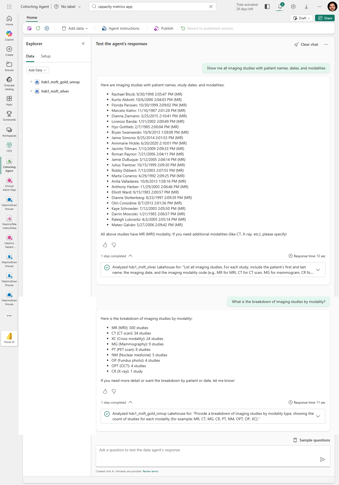

# Fabric DICOM Cohorting Toolkit

An end-to-end toolkit for patient cohorting and medical imaging on [Microsoft Fabric Healthcare Data Solutions (HDS)](https://learn.microsoft.com/en-us/industry/healthcare/healthcare-data-solutions/overview). It combines a natural-language data agent, a Power BI imaging report, and a zero-dependency DICOM viewer — all wired together so clinicians and researchers can identify patient cohorts, explore imaging studies, and view DICOM images directly from Fabric without provisioning Azure Health Data Services.

**Key capabilities:**

- **Ask questions in plain English** — the Fabric Data Agent translates natural-language cohorting queries into SQL across FHIR R4 (silver) and OMOP CDM v5.4 (gold) lakehouses
- **Interactive imaging dashboard** — Power BI report with demographic slicers, study tables, drillthrough from patient overview to patient-specific imaging details, and one-click links to view DICOM images
- **Just-in-time DICOM viewer** — OHIF Viewer backed by a lightweight DICOMweb proxy that fetches `.dcm.zip` files on-demand from OneLake — no pre-loading, no AHDS dependency
- **Idempotent workspace-aware deployment** — specify a Fabric workspace name and the deploy script auto-discovers the SQL endpoint, rebuilds the DICOM index, and skips redeploy if nothing changed

## Overview

This project contains three components that work together:

| Component | Purpose |
|-----------|---------|
| **Cohorting Data Agent** | Fabric Data Agent that answers natural-language questions about patient cohorts using SQL over FHIR R4 (silver) and OMOP CDM v5.4 (gold) databases |
| **Imaging Report** (.pbip) | Power BI report with demographic slicers, patient tables, and clickable DICOM viewer links for imaging studies |
| **DICOM Viewer** | OHIF Viewer + DICOMweb proxy deployed to Azure, serving DICOM images just-in-time from OneLake |

## Architecture


## Prerequisites

### Fabric Healthcare Data Solutions

This project requires a deployed [Microsoft Fabric Healthcare Data Solutions (HDS)](https://learn.microsoft.com/en-us/industry/healthcare/healthcare-data-solutions/overview) environment with:

- **Silver Lakehouse** (`hds1_msft_silver`) — FHIR R4 resources ingested and flattened. Required tables:
  - `dbo.Patient` — patient demographics (name, gender, birthDate)
  - `dbo.ImagingStudy` — imaging study metadata (modality, series, subject reference)
  - `dbo.ImagingMetastore` — DICOM file index (studyInstanceUid, seriesInstanceUid, sopInstanceUid, filePath to OneLake)
  - `dbo.Condition`, `dbo.MedicationRequest`, `dbo.Observation`, `dbo.Encounter`, `dbo.Procedure` — for cohorting queries

- **Gold Lakehouse** (`hds1_msft_gold_omop`) — OMOP CDM v5.4 transformation. Required tables:
  - `dbo.person` — person demographics with `person_source_value` (SHA-256 hash matching silver `Patient.id`)
  - `dbo.concept` — vocabulary concepts for race, ethnicity, conditions
  - `dbo.condition_occurrence`, `dbo.drug_exposure`, `dbo.measurement`, `dbo.observation` — for cohorting

- **Fabric Data Warehouse SQL Endpoint** — both databases accessible via the same Fabric SQL endpoint

### DICOM Data in OneLake

Imaging files stored as `.dcm.zip` in OneLake under the silver lakehouse `Files/` path, indexed by `ImagingMetastore.filePath` (abfss:// URIs).

### Azure Subscription (for DICOM Viewer)

- Azure CLI (`az`) authenticated
- Contributor access to create: Container App, Static Web App, Container Registry, Log Analytics
- Node.js 18+ and Yarn (for OHIF build)

## Project Structure

```
cohortingDataAgent/
├── data-agent-instructions.md          # Fabric Data Agent instruction set
├── fewshots-silver-fhir.json           # 20 few-shot examples for FHIR silver queries
├── fewshots-gold-omop.json             # 15 few-shot examples for OMOP gold queries
│
├── ImagingReport.pbip                  # Power BI Project root
├── ImagingReport.SemanticModel/        # Semantic model (TMDL)
│   └── definition/
│       ├── tables/
│       │   ├── Patient.tmdl            # FHIR patients with imaging studies
│       │   ├── ImagingStudy.tmdl       # Imaging studies with ViewerUrl
│       │   ├── DicomFile.tmdl          # Individual DICOM instances from ImagingMetastore
│       │   ├── PersonDemographics.tmdl # Race/ethnicity from OMOP gold
│       │   ├── ModalityLookup.tmdl     # Modality code → display name (filtered to data)
│       │   └── _Measures.tmdl          # DAX measures (counts, averages)
│       ├── expressions/
│       │   └── OhifViewerBaseUrl.tmdl  # M parameter — OHIF Viewer base URL
│       ├── relationships.tmdl          # 4 relationships (bidirectional cross-filter)
│       └── model.tmdl
├── ImagingReport.Report/               # Report definition (PBIR)
│   └── definition/
│       └── pages/
│           ├── imaging_overview_page01/  # Overview: slicers, KPIs, patient table, charts
│           └── patient_images_page02/    # Patient detail: study table, DICOM files, viewer links
│
└── dicom-viewer/                       # DICOM Viewer deployment
    ├── Deploy-DicomViewer.ps1          # One-command deployment (workspace-aware, idempotent)
    ├── build_index.py                  # Build study index from Fabric ImagingMetastore
    ├── .deployment-state.json          # Tracks current workspace/server for idempotent checks
    ├── infra/
    │   ├── main.bicep                  # ACR + Container App + Static Web App
    │   └── main.bicepparam
    ├── proxy/
    │   ├── app.py                      # DICOMweb proxy (Flask) — JIT fetch from OneLake
    │   ├── Dockerfile
    │   ├── requirements.txt
    │   └── dicom_index.json            # Study index (generated by build_index.py)
    └── ohif/
        ├── app-config.js               # OHIF configuration template
        └── staticwebapp.config.json    # SWA routing/headers
```

## Component Details

### 1. Cohorting Data Agent

A Fabric Data Agent that translates natural-language patient cohorting questions into SQL. Configured with:



- **Instruction set** (`data-agent-instructions.md`) — 160 lines covering silver-first query architecture, FHIR JSON patterns, PII rules, and 30+ example queries
- **Few-shot examples** — separate JSON files for silver FHIR (20 examples) and gold OMOP (15 examples)

**Key rules:**
- Silver-first: Always query FHIR tables first; only use gold for race/ethnicity concepts
- No cross-database JOINs (Fabric limitation)
- FHIR JSON columns use `JSON_VALUE` for extraction, `LIKE` for filtering (not `JSON_VALUE` in `WHERE`)
- PII: Never return names/addresses/SSNs; use SHA-256 hashed `Patient.id`

**Setup:** Upload the three files to your Fabric Data Agent configuration in the Fabric portal.

### 2. Imaging Report (.pbip)

Power BI Desktop project with two report pages:

**Page 1 — Imaging Overview:**


- Slicers: Gender, Modality, Race, Age Range
- KPI cards: Total Patients, Total Studies, Total DICOM Files
- Patient table with demographics and study counts
- Modality distribution bar chart, Gender donut chart
- **Drillthrough:** Right-click a patient row → Drillthrough → Patient Images to jump to page 2 filtered to that patient

**Page 2 — Patient Images:**


- Patient name slicer, Modality slicer, PatientId text search
- Drillthrough target — filtered automatically when navigating from page 1
- Studies table with clickable ViewerUrl (opens OHIF Viewer)
- DICOM files table with RenderedImageUrl links
- Patient Studies and Patient DICOM Files KPI cards

**Semantic model:**
- 6 tables sourced from two Fabric databases (silver FHIR + gold OMOP)
- `OhifViewerBaseUrl` M parameter — change the OHIF URL in one place
- Bidirectional cross-filtering so modality/demographic slicers filter correctly

**Setup:** Open `ImagingReport.pbip` in Power BI Desktop. Authenticate to the Fabric SQL endpoint via Microsoft Entra. Update `OhifViewerBaseUrl` parameter via Transform Data → Manage Parameters.

### 3. DICOM Viewer

Open-source DICOM viewing stack — no AHDS dependency, no pre-loading.


| Component | Technology | Azure Service |
|-----------|-----------|---------------|
| Viewer UI | [OHIF Viewer v3](https://ohif.org) (MIT) | Static Web Apps |
| DICOMweb Proxy | Python/Flask + pydicom | Container Apps |
| Image Registry | — | Container Registry (Basic) |

**JIT flow:** When a user clicks a ViewerUrl in Power BI → OHIF opens → requests DICOMweb metadata/frames → proxy fetches `.dcm.zip` from OneLake on-demand → parses with pydicom → returns full DICOM metadata and pixel data → OHIF renders the image.

**Deploy:**
```powershell
cd dicom-viewer

# Deploy (auto-discovers SQL endpoint, rebuilds index, deploys infra)
.\Deploy-DicomViewer.ps1 -ResourceGroup rg-hds-dicom -FabricWorkspaceName "my-hds-workspace"

# Switch to a different workspace (detects change, redeploys automatically)
.\Deploy-DicomViewer.ps1 -ResourceGroup rg-hds-dicom -FabricWorkspaceName "other-workspace"

# Re-run same workspace (idempotent — skips if nothing changed)
.\Deploy-DicomViewer.ps1 -ResourceGroup rg-hds-dicom -FabricWorkspaceName "my-hds-workspace"

# Force redeploy even if unchanged
.\Deploy-DicomViewer.ps1 -ResourceGroup rg-hds-dicom -FabricWorkspaceName "my-hds-workspace" -Force
```

**Post-deployment:**
- Grant the `hds-dicom-proxy` service principal **Contributor** role in the Fabric workspace (required for OneLake file access)
- Update `OhifViewerBaseUrl` in the Power BI semantic model with the deployed SWA hostname

## Configuration

### Fabric SQL Endpoint

The SQL endpoint server is configured in the TMDL partition sources. To change it, update the `Sql.Database(...)` calls in:
- `Patient.tmdl`
- `ImagingStudy.tmdl`
- `DicomFile.tmdl`
- `PersonDemographics.tmdl`

### OHIF Viewer URL

Set via the `OhifViewerBaseUrl` M parameter in `expressions/OhifViewerBaseUrl.tmdl` or via Power BI Desktop → Transform Data → Manage Parameters.

### DICOM Viewer Proxy

The proxy's `dicom_index.json` maps studyInstanceUid → OneLake file paths. The deploy script automatically rebuilds the index when you specify `-FabricWorkspaceName`. To manually rebuild:
```powershell
$env:FABRIC_SERVER = "<sql-endpoint>.datawarehouse.fabric.microsoft.com"
$env:FABRIC_DB = "<silver-lakehouse-name>"
python build_index.py --output proxy/dicom_index.json
.\Deploy-DicomViewer.ps1 -ResourceGroup rg-hds-dicom -FabricWorkspaceName "my-workspace" -Force
```

The deploy script stores workspace state in `.deployment-state.json`. On re-run, it compares the current Fabric workspace's SQL endpoint and database name against the saved state — if unchanged, it skips the redeploy. If a different workspace is specified, it rebuilds the index and redeploys the proxy container.

## .gitignore Recommendations

Add to `.gitignore`:
```
ohif-build/
proxy-deploy.zip
*.python_packages/
__pycache__/
.pbi/cache.abf
.deployment-state.json
```

## License

See individual component licenses:
- OHIF Viewer: MIT
- pydicom: MIT
- Fabric Data Agent instructions and report: Provided as-is
